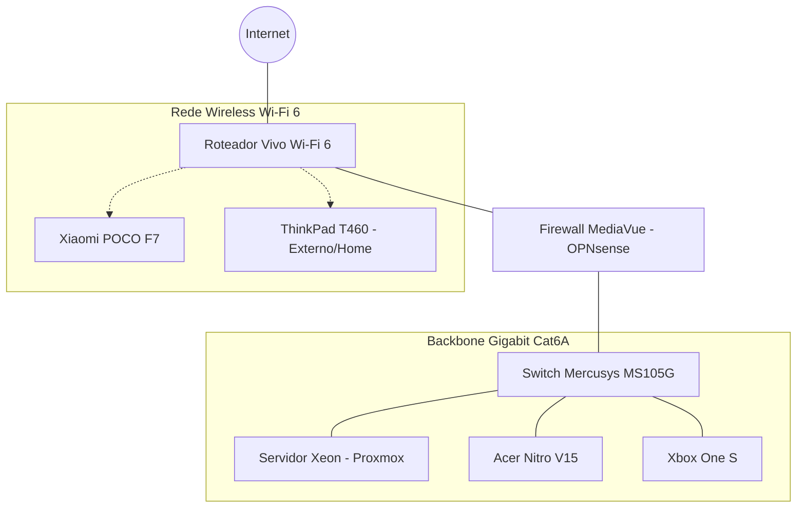

# 🏠 homelab-topology-v2 - Infraestrutura & Networking

Este repositório documenta a evolução técnica da minha infraestrutura doméstica e laboratório de redes. O projeto foca em virtualização de alto desempenho, segurança perimetral com hardware dedicado e escalabilidade de serviços.

**Status do Projeto:** 🚀 Fase de Expansão (Aguardando placa Ethernet M.2 Gigabit para o Gateway OPNsense).

---

## 🖥️ Especificações de Hardware

Abaixo estão detalhados os nós de processamento e dispositivos que compõem o ecossistema do laboratório.

| Dispositivo | Processador | RAM | Armazenamento | S.O. Instalado |
| :--- | :--- | :--- | :--- | :--- |
| **Main Server (Xeon)** | E5-2680 V4 (14C/28T) | 16GB DDR4 | 500GB NVMe + 1TB HDD | [Proxmox VE](https://www.proxmox.com/) |
| **Firewall (MediaVue)** | AMD GX-424CC (4C/4T) | 16GB DDR3 | 120GB mSATA SSD | [OPNsense](https://opnsense.org/) |
| **Workstation (Acer)** | i7-13620H (RTX 4050) | 32GB DDR5 | 512GB NVMe Gen4 | [Windows 11 Pro](https://www.microsoft.com/software-download/windows11) |
| **Laptop (ThinkPad)** | i5-6300U | 16GB DDR3 | 256GB SSD | [Kubuntu Linux](https://kubuntu.org/) |
| **Mobile (Poco)** | Snapdragon 8s Gen 4 | 12GB RAM | 512GB Flash | Android 15 (HyperOS) |

---

## 🌐 Topologia de Rede (Lógica)

Este diagrama representa a arquitetura de rede planejada para o laboratório, utilizando cabeamento estruturado **Cat6A**.

## 🎒 Cenários de Operação
🏠 Cenário Doméstico
Focado em administração de servidores, virtualização via Proxmox, hospedagem de servidores de jogos (Minecraft) e backups redundantes. O nó Xeon gerencia containers LXC e VMs críticas para o ecossistema.

🏫 Cenário Móvel (Faculdade)
O ThinkPad T460 atua como estação de controle portátil para desenvolvimento em Docker, estudos de automação e acesso remoto seguro via VPN ao Home Lab.

## 🛡️ Segurança e Privacidade
A segurança da informação é prioridade neste projeto, seguindo boas práticas de infraestrutura:

Endereçamento: Por motivos de segurança, IPs públicos e privados não são documentados neste repositório.

Credenciais: Chaves de acesso, tokens e senhas são gerenciados via arquivos locais protegidos (.env) e não são sincronizados.

Segmentação: O firewall MediaVue é projetado para isolar o tráfego de serviços expostos da rede de gerenciamento pessoal.

Acesso Remoto: Implementação de túneis criptografados para acesso externo, eliminando a exposição desnecessária de portas na WAN.

## 🛠️ Roadmap de Evolução
[ ] Instalação da Placa Ethernet M.2 no MediaVue.

[ ] Configuração de VLANs para segmentação de dispositivos IoT.

[ ] Implementação de Dashboard de Monitoramento (Grafana/Prometheus).

[ ] Automação de Backups Off-site.

Documentação mantida por João Gustavo como parte de laboratório contínuo de estudos em Redes e Infraestrutura.
